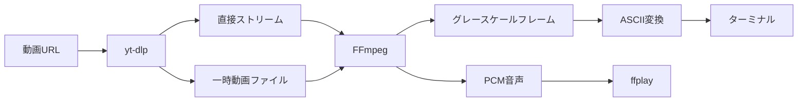

# ascii-dlp

`yt-dlp` で取得した動画を、ターミナル上のASCIIアートとして音声付き再生するCLIです。

```text
                  ..,::;;;;::,..
             .:irsX253hMHGS#9B&@;
          ,;s5HGS#9B&&@@@&&B9#HM2:
        :r2H#B&@@@@@@@@@@@@@@@@@#5,
       i5G&@@@@@@@&&B99B&&@@@@@@@H:
```

URLは通常ストリーミングで即時再生します。映像と音声が別ストリームの場合、Cookieを使う場合、または直接再生できない場合は、`yt-dlp` が一時ファイルへ取得・結合してから再生します。一時ファイルは終了時に削除されます。

## 特長

- YouTubeを含む、`yt-dlp` 対応サイトの動画URLを利用可能
- ローカルの動画ファイルも再生可能
- 端末サイズに合わせて縦横比を自動調整
- 音声再生、一時停止、シークに対応
- FPS、文字セット、ガンマ、コントラスト、明暗反転を変更可能
- Windows、macOS、Linux対応
- シェルを介さずFFmpegを起動するため、空白や日本語を含むパスにも対応

## 必要なもの

- Python 3.10以上
- [FFmpeg](https://ffmpeg.org/download.html)
  - `ffmpeg`: 映像デコード
  - `ffprobe`: 動画情報の取得
  - `ffplay`: 音声再生。なくても無音で動作
- WindowsではWindows Terminalを推奨

FFmpegをインストールしたら、`ffmpeg`、`ffprobe`、`ffplay` がPATHから実行できる状態にしてください。

## インストール

GitHub Releaseのwheelを直接指定できます。リポジトリのcloneは不要で、`yt-dlp`も依存関係として一緒にインストールされます。

### Windows PowerShell

```powershell
py -m pip install --upgrade "https://github.com/Xenoah/ascii-dlp/releases/download/v1.0.0/ascii_dlp-1.0.0-py3-none-any.whl"
py -m ascii_dlp doctor
```

### macOS / Linux

```bash
python3 -m pip install --upgrade "https://github.com/Xenoah/ascii-dlp/releases/download/v1.0.0/ascii_dlp-1.0.0-py3-none-any.whl"
python3 -m ascii_dlp doctor
```

仮想環境や`pipx`を利用している場合も、同じwheel URLをインストール対象に指定できます。FFmpegはwheelに含まれないため、別途インストールしてください。

## 使い方

URLは`&`などを含む場合があるため、引用符で囲んでください。

```bash
ascii-dlp "https://www.youtube.com/watch?v=VIDEO_ID"
```

ローカル動画：

```bash
ascii-dlp "C:\Videos\sample.mp4"
```

描画を軽くする：

```bash
ascii-dlp "URL" --fps 10 --max-width 80
```

文字セットを変更：

```bash
ascii-dlp "URL" --chars " .:-=+*#%@"
```

1分30秒から無音で再生：

```bash
ascii-dlp "URL" --start 01:30 --no-audio
```

先にダウンロードして安定再生：

```bash
ascii-dlp "URL" --download
```

動画ファイルを残す：

```bash
ascii-dlp "URL" --download-dir ./downloads
```

ログイン済みブラウザのCookieを使う：

```bash
ascii-dlp "URL" --cookies-from-browser edge
```

動画情報だけ確認：

```bash
ascii-dlp "URL" --info
```

すべてのオプション：

```bash
ascii-dlp --help
```

## 再生中の操作

| キー | 動作 |
|---|---|
| `Space` | 一時停止 / 再開 |
| `←` / `H` / `A` | 5秒戻る |
| `→` / `L` / `D` | 5秒進む |
| `↓` / `J` / `S` | 30秒戻る |
| `↑` / `K` / `W` | 30秒進む |
| `Q` | 終了 |

移動秒数は`--seek-step`と`--long-seek-step`で変更できます。ライブ配信など長さが取得できない動画ではシークしません。

## 仕組み



映像はFFmpegから8bitグレースケールのraw frameとして受け取り、輝度ごとにASCII文字へ変換します。文字セルが縦長であることも加味して、元動画の見た目に近い縦横比へ補正します。

## よくある問題

### `ffmpeg が見つかりません`

FFmpegの実行ファイルをPATHへ追加するか、場所を直接指定します。

```bash
ascii-dlp "URL" --ffmpeg-location "C:\Tools\ffmpeg\bin"
```

### 音が出ない

`ascii-dlp doctor`で`ffplay`を確認してください。Bluetooth機器などで映像とのずれがある場合は補正できます。

```bash
ascii-dlp "URL" --audio-latency-ms 180
```

### URLでは再生できない

直接ストリームを開けないサイトでは自動的に一時取得へ切り替わります。それでも失敗する場合は明示的に`--download`を付け、必要なら`--cookies-from-browser`を利用してください。

### 画面が重い

`--fps 10 --max-width 80`のようにFPSと文字幅を下げてください。

## 開発

```bash
python -m pip install -e ".[dev]"
python -m pytest
python -m ruff check .
```

CIではWindows、macOS、LinuxとPython 3.10 / 3.12 / 3.13の組み合わせを検証します。

## 制限事項

- DRM保護された動画は再生できません。
- 音声デバイス固有の遅延により、完全なサンプル単位の同期にはなりません。
- 現在は単一動画の再生が対象です。プレイリストURLは先頭1件だけを扱います。
- 端末のフォントや文字セル比率によって見え方が変わります。

## ライセンスと利用上の注意

本プロジェクトはMIT Licenseです。`yt-dlp` はUnlicenseで提供される外部依存関係です。

動画の利用規約、著作権、アクセス権を守り、視聴・取得する権限があるコンテンツにだけ使用してください。
